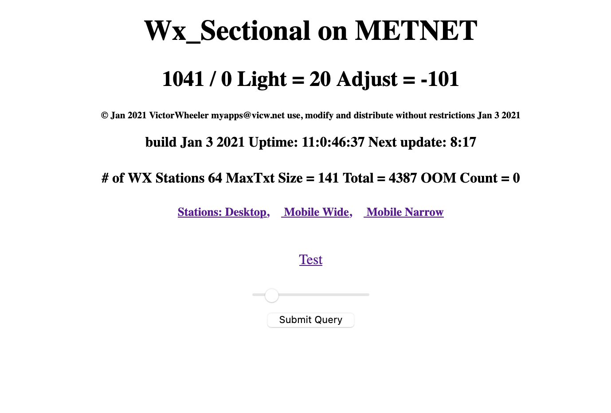
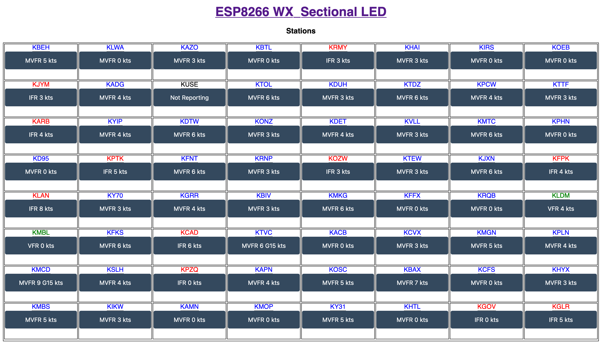
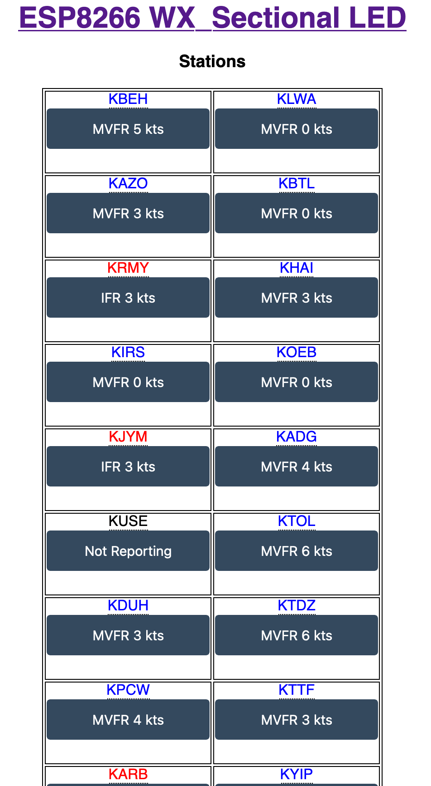
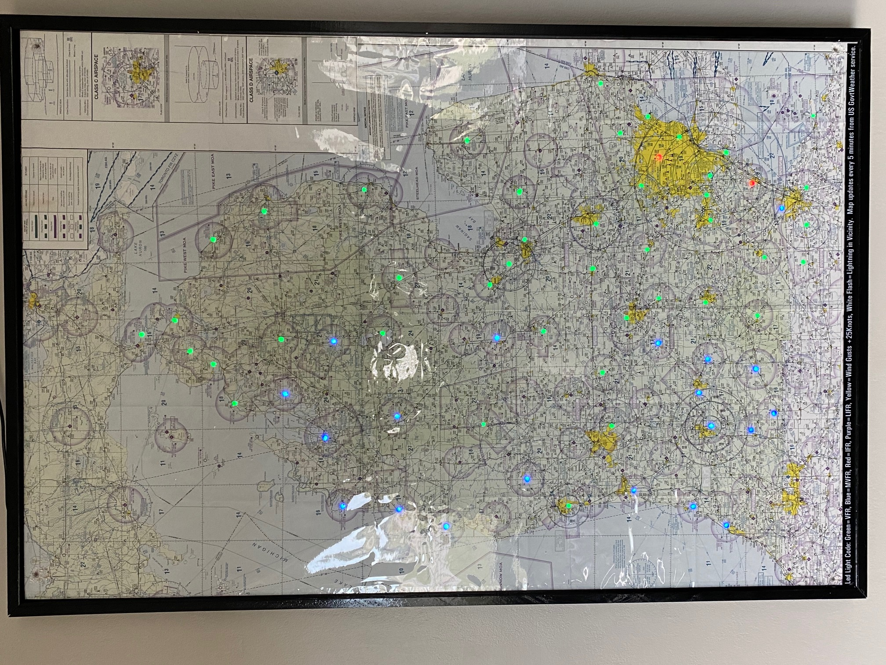

# WX_LED_Sectional
Use an ESP8266 to download METARs for multiple airports displaying the metrology conditions using colored LEDs the LEDs can be put into a sectional chart / map. It is inspired by https://led-sectional.kyleharmon.com/
This version generates an HTML page that displays the Conditions,  Condition colors, METAR raw text and ID button for each station 
 
 Root Page 

Stations Desktop

Stations Mobile

LED Sectional

Setup for Arduino IDE:
New setup for Arduino for TiVoHomeUser WX_LED_Sectional on Windows 11 Pro
 - Install Arduino from https://www.arduino.cc/en/software/
 
 - From Arduino IDE -> Preferences -> Additional boards manager URLs: add
						http://arduino.esp8266.com/stable/package_esp8266com_index.json
 - Tools -> Board -> Board Manager Install “ESP8266 by ESP8266 community” 
 - Tools -> Board -> ESP8266 -> “LOLIN(WEMOS) D1 mini Lite”

 - Tools -> Manage Library	Find and install 2 libraries
	WiFiManager			by tzapu
	FastLED			by Daniel Garcia

 - Paste the unzipped WX_LED_Sectional folder somewhere I put it in Documents/Arduino folder
 -  From Arduino IDE -> file -> Open WX_LED_Sectional.
 
