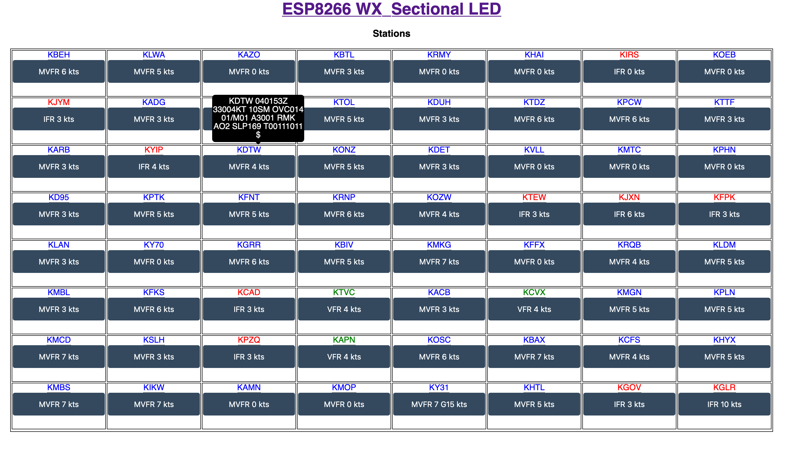

# WX_LED_Sectional
Use an ESP8266 to download METARs for multiple airports displaying the metrology conditions using colored LEDs the LEDs can be put into a sectional chart / map. It is inspired by https://www.reddit.com/r/flying/comments/7avr8q/flight_conditions_sectional_wall_art_thing/

This version generates an HTML page that displays the Conditions,  Condition colors, METAR raw text and ID button for each station 
 
 Root Page 

Stations Desktop

Stations Mobile

